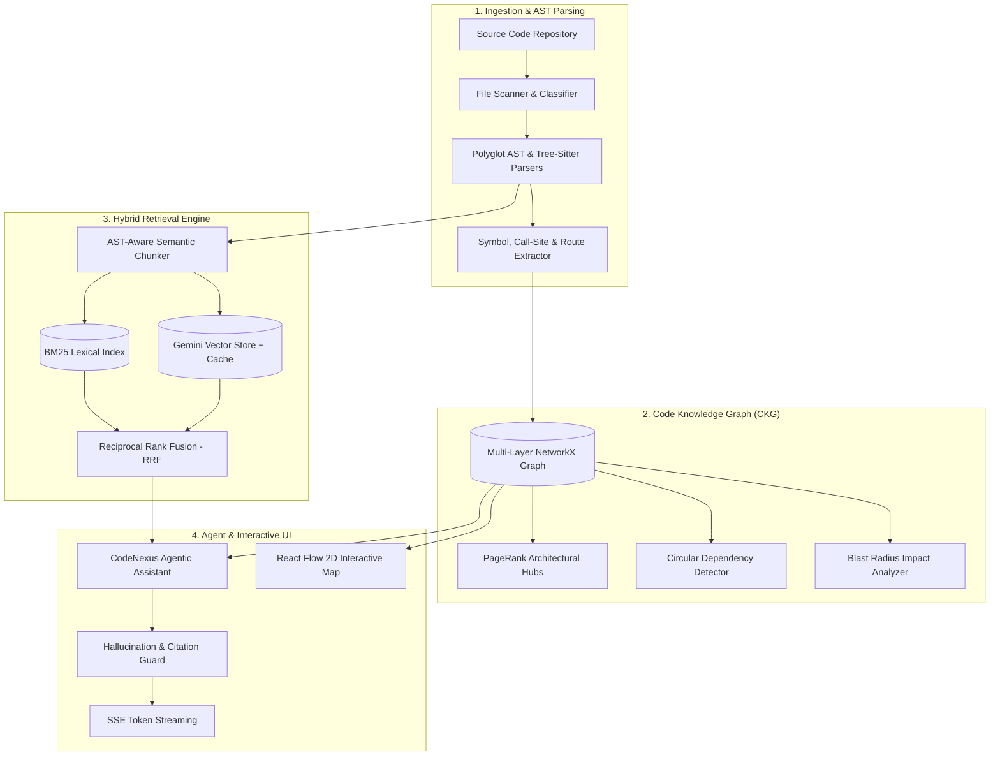

# 🌐 CodeNexus

> **Autonomous Codebase Intelligence & Architecture Explorer**  
> *Map symbols, trace imports, visualize dependency graphs, simulate impact blast radius, and chat with your code with zero hallucinations.*

---

## 📖 What is CodeNexus?

Joining an unfamiliar or large codebase is slow and overwhelming. The questions you need answered first — *Where does execution start? What depends on what? If I change this function, what will break?* — usually require reading through dozens of files.

General-purpose chatbots often guess or hallucinate connections between files without verifying if those files or functions actually exist.

**CodeNexus takes a structural, graph-first approach:**
1. **Scans & Parses**: Parses code into Abstract Syntax Trees (AST) to extract functions, classes, methods, endpoints, and import statements.
2. **Builds a Code Knowledge Graph (CKG)**: Connects files, symbols, and routes to construct a multi-layer graph of who calls what and what imports what.
3. **Computes Architecture Insights**: Runs NetworkX PageRank centrality algorithms to identify architectural hubs, detects circular import cycles, and spots dead/unreferenced code.
4. **Agentic GraphRAG with Citation Verification**: Answers complex code questions by retrieving only verified AST chunks, providing confidence scores, and highlighting exact file citations.
5. **PR Blast Radius Simulation**: Allows developers to select any file or function and instantly trace the reverse-dependency wave to see every affected upstream file, symbol, and API route.

---

## 🏗️ Architecture & Dataflow



---

## ✨ Key Features

| Feature | Description |
| :--- | :--- |
| 🔍 **Polyglot AST Parsing** | Extracts top-level and nested classes, functions, methods, docstrings, parameters, return types, imports, and web framework routes (FastAPI, Express). |
| 🗺️ **Interactive Architecture Map** | Drag, zoom, search, and inspect file nodes on a 2D canvas powered by React Flow with real-time symbol counts and LOC badges. |
| 💥 **PR Diff & Blast Radius Analyzer** | Simulates downstream impact when modifying a component, ranking changes from `LOW` to `CRITICAL RISK` based on affected endpoints. |
| 📊 **PageRank Centrality Hubs** | Automatically identifies the core "hub" files that the rest of the codebase relies on. |
| 🔄 **Cycle & Dead Code Detector** | Detects strongly connected circular dependency loops and spots candidate unreferenced internal functions. |
| 💬 **Grounded AI Chat Assistant** | Real-time SSE streaming answers with clickable source citations, confidence scores, and anti-hallucination diagnostic checks. |
| ⚡ **Zero-Docker Hybrid Engine** | Runs completely locally with embedded caching and BM25 fallback, with optional Gemini AI integration. |

---

## 🚀 Quick Start Guide

### Prerequisites
- **Python 3.10+**
- **Node.js 18+**

---

### Step 1: Start the Backend (FastAPI)

```bash
# Navigate to backend directory
cd backend

# Create and activate virtual environment
python -m venv venv

# On Windows (PowerShell):
.\venv\Scripts\Activate.ps1
# On macOS / Linux:
source venv/bin/activate

# Install dependencies
pip install -r requirements.txt

# Run backend server
uvicorn app.main:app --reload --port 8000
```

> Backend API: `http://127.0.0.1:8000`  
> Interactive Swagger API Documentation: `http://127.0.0.1:8000/docs`

---

### Step 2: Start the Frontend (React + Vite)

In a separate terminal window:

```bash
# Navigate to frontend directory
cd frontend

# Install dependencies
npm install

# Start Vite dev server
npm run dev
```

> Open your browser at: `http://localhost:5173`

---

## 🗂️ Project Directory Structure

```text
CodeNexus/
├── backend/
│   ├── app/
│   │   ├── api/
│   │   │   └── routes.py         # API endpoints (/scan, /graph, /ask, /impact, /file/content)
│   │   ├── parsers/
│   │   │   ├── scanner.py        # Walks directories and classifies source files
│   │   │   ├── python_parser.py  # Python AST symbol, import, and route extractor
│   │   │   ├── ts_js_parser.py   # TypeScript & JavaScript parser
│   │   │   ├── factory.py        # Language-based parser dispatcher
│   │   │   └── models.py         # Pydantic models (FileMetadata, SymbolNode, ImportNode)
│   │   ├── graph/
│   │   │   ├── builder.py        # Multi-layer NetworkX graph builder & React Flow adapter
│   │   │   └── analyzer.py       # PageRank, cycle detection, and blast radius engine
│   │   ├── indexing/
│   │   │   ├── chunker.py        # AST-aware deterministic code chunker
│   │   │   └── vector_store.py   # Zero-docker hybrid retrieval (BM25 + Gemini Embeddings + RRF)
│   │   ├── agent/
│   │   │   └── reasoning.py      # AI assistant reasoning and citation verification guard
│   │   ├── core/
│   │   │   └── config.py         # Pydantic Settings and environment configuration
│   │   └── main.py               # FastAPI entrypoint with CORS
│   ├── tests/
│   │   ├── test_core.py          # Pytest unit tests for parser, graph, and vector store
│   │   └── test_live_api.py      # Live API integration tests
│   └── requirements.txt
│
└── frontend/
    ├── src/
    │   ├── components/
    │   │   ├── Navbar.tsx           # Navigation header with repo input & scan button
    │   │   ├── OverviewView.tsx     # Overview cards, PageRank leaderboard, and file explorer
    │   │   ├── GraphCanvas.tsx      # React Flow interactive 2D graph with minimap
    │   │   ├── BlastRadiusView.tsx  # Impact simulator (Low to Critical risk breakdown)
    │   │   ├── ChatAssistant.tsx    # Streaming chat with confidence & clickable file chips
    │   │   ├── MetricsView.tsx      # Health insights, cycle detector & dead code finder
    │   │   └── FileViewerModal.tsx  # Modal code viewer with line numbers and copy button
    │   ├── types.ts                 # Clean TypeScript interface definitions
    │   ├── App.tsx                  # Main layout and tab coordinator
    │   └── index.css                # Obsidian dark theme & glassmorphism styling
    ├── package.json
    └── vite.config.ts
```

---

## 📡 API Overview

Every endpoint returns structured JSON data or Server-Sent Events (SSE):

| Method | Endpoint | Description |
| :--- | :--- | :--- |
| `GET` | `/api/status` | Health check, active repository path, and index status. |
| `POST` | `/api/scan` | Scans repository path, parses ASTs, builds CKG, and computes metrics. |
| `POST` | `/api/index` | Chunks AST symbols and builds hybrid BM25 + Vector index. |
| `GET` | `/api/graph` | Returns draw-ready nodes and edges for React Flow. |
| `GET` | `/api/metrics` | Returns PageRank hubs, circular dependencies, and dead symbols. |
| `GET` | `/api/impact` | Calculates blast radius and affected endpoints for a given symbol/file. |
| `GET` | `/api/file/content`| Fetches raw source text for the syntax-highlighted file viewer. |
| `POST` | `/api/ask` | SSE streaming endpoint for grounded answers with confidence & citations. |

---

## 🔮 Future Scopes & Development Roadmap

CodeNexus is architected to scale from a single-developer desktop tool to an enterprise-grade code intelligence platform. Planned future milestones include:

### 1. 🌐 Polyglot Expansion (C++, Go, Rust, Java, C#)
- Integrate additional Tree-sitter grammars and **SCIP / LSIF** (Source Code Intelligence Protocol) indexers for enterprise-grade cross-file symbol resolution across Go, Rust, Java, C++, and C#.

### 2. 🤖 Automated Git PR Review Bot & CI/CD Integration
- Run CodeNexus automatically as a **GitHub Action / GitLab CI step** on incoming Pull Requests.
- Post automated PR comments containing:
  - Visual blast radius breakdown of modified functions.
  - Affected public API routes and downstream breaking changes.
  - Architectural health alerts (new cycles introduced or dead code added).

### 3. 🏙️ 3D Code City Visualization
- Render large codebases as an interactive **3D Code City (Three.js / WebGL)** where buildings represent files (height = LOC, width = complexity) and roads represent import/call dependencies.

### 4. 🧪 Automated Test & Refactor Generation
- Integrate test-generation agents that automatically generate unit tests for uncalled/dead functions or newly added symbols.
- Produce verified unified diffs (`git apply` patches) directly from chat answers.

### 5. 🔌 IDE Extensions (VS Code & JetBrains)
- Build lightweight extensions for VS Code and JetBrains IDEs allowing developers to click any function in their editor to open CodeNexus Blast Radius and call graphs in a side panel.

### 6. 🏢 Monorepo & Multi-Service Distributed Tracing
- Add support for distributed multi-repo architectures, mapping microservice dependencies across REST APIs, gRPC protobufs, and GraphQL schemas.

---

## 🤝 Contributing

Contributions, issues, and feature requests are welcome!
1. Fork the Project
2. Create your Feature Branch (`git checkout -b feature/AmazingFeature`)
3. Commit your Changes (`git commit -m 'feat: add some AmazingFeature'`)
4. Push to the Branch (`git push origin feature/AmazingFeature`)
5. Open a Pull Request

---

## 📄 License

Distributed under the **MIT License**. See `LICENSE` for more information.
